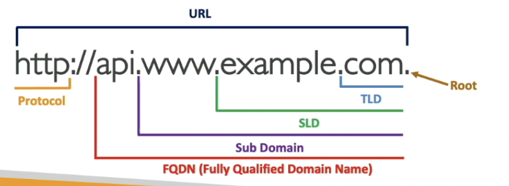
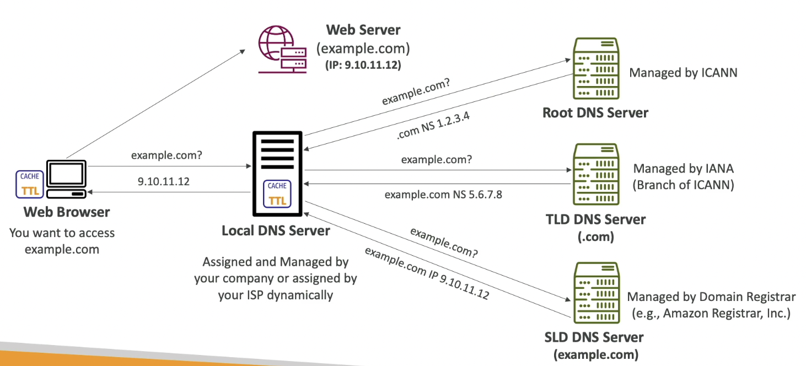

# Route 53
## DNS
- Domain Name System which translates the human friendly hostnames into machine IP address.
- www.google.com -> 172.10.12.11
- DNS is the backbone of the internet.

- DNS terminologies
    - Domain Registrar : Amazon ROute 53, GoDaddy
    - DNS records : A, AAAA, CNAME, NS
    - Zone File: contain DNS records
    - Name Server: resolves DNS queries(Authoritative)
    - Top level Domain: .com, .us, .in, .gov, .org
    - Second Level Domain: amazon.com, google.com 


### How DNS works ?


## Route 53
- A highly availaible, scalable, fully managed and authoritative DNS(the customer can make changes to DNS records).
- Ability to check health of your services
- Only AWS service which provides 100% avalaibility SLA
- Each record contains
    - Domain/subDomain Name: eg: example.com
    - RecordType: eg: A, AAAA
    - Value: 12.456.52.10
    - Routing Policy: how Route53 responds to queries
    - TTL: amount of time the record cached at DNS resolvers.

## Record Types
- A : maps a hostname to IPV4
- AAAA: maps a hostname to IPV6
- CNAME: maps a hostname to another hostname
    - the target is a domain name which must have an A or AAAA record
- NS : Name Server for hosted zones.
    - Control how traffic is routed for a domain

## Route53: Hosted Zones
- A container for records that define how to route traffic to a domain and its subdomains
- Public Hosted Zones:
    - contain records that specify how to route traffic on the internet
- Private Hosted Zones:
    - contain records that specify how you route traffic within one or more VPCs.

## DNS TTL
- you can set the TTL for DNS record, so that way the client caches the domain and doesn't query the DNS for resolving the request.
- It has to be mandatorily set for all records expect alis.
eg: command => `dig google.com`
```

; <<>> DiG 9.10.6 <<>> google.com
;; global options: +cmd
;; Got answer:
;; ->>HEADER<<- opcode: QUERY, status: NOERROR, id: 57001
;; flags: qr rd ra; QUERY: 1, ANSWER: 4, AUTHORITY: 0, ADDITIONAL: 0

;; QUESTION SECTION:
;google.com.			IN	A

;; ANSWER SECTION:
google.com.		339	IN	A	142.250.77.238
google.com.		339	IN	A	142.250.194.142
google.com.		339	IN	A	142.250.206.142
google.com.		339	IN	A	142.250.193.238

;; Query time: 8 msec
;; SERVER: 192.168.1.1#53(192.168.1.1)
;; WHEN: Wed Feb 19 17:24:28 IST 2025
;; MSG SIZE  rcvd: 92

```
- here 339 is the amount of second that record is cached at client side, caching for larger amt can help save queries on DNS and thus reduce cost.

## CNAME vs Alias
- AWS resources (Load Balancer, CloudFront) expose an AWS hostname.
- lb 1-1234.us-east-2.elb.amazonaws.com and you want myapp.domain.com

### CNAME
    - points to a hostname to any other hostname
    - only for non root domain(aka.something.mydomain.com)
### Alias
    - points a hostname to an AWS resource
    - works for Root Domain and Non Root Domain
    - Free of charge
    - native health check
    - Is always of type A/AAAA for AWS resources
    - Automatically recognizes changes in resource's IP address
    - TTL cannot be set for Alias Record, it's automatically set by Route53

### Alias Record targets
- You cannot set Alias record for EC2 DNS Name
- Elastic Load Balancers
- CloudFront Distributions
- API Gateway
- S3 websites
- VPC interace endpoints

## Routing Policies
- Define how Route53 responds to DNS queries.
- Supports following Routing Policies
    - Simple
        - Typically route traffic to a single resource.
        - Can specify multiple values in the same record.
        - When Alias enabled specify only one aws resource.
        - Can't be associated with health checks.
    - Weighted
        - Controls the % of requests that go to each specific resource.
        - DNS records must have same name and type
        - Can be associated with health checks.
    - Failover
    - Latency Based
    - Geolocation
    - Multi-Value Answer
    - GeoProximity