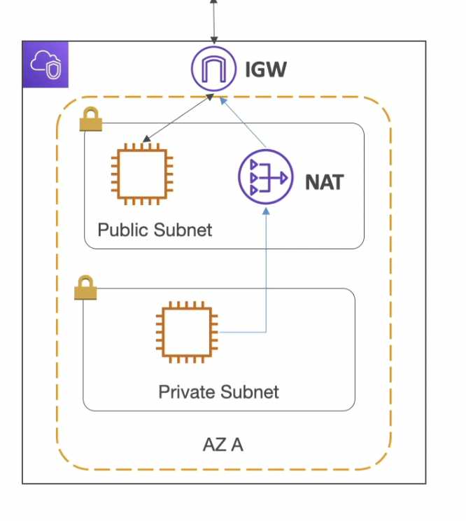
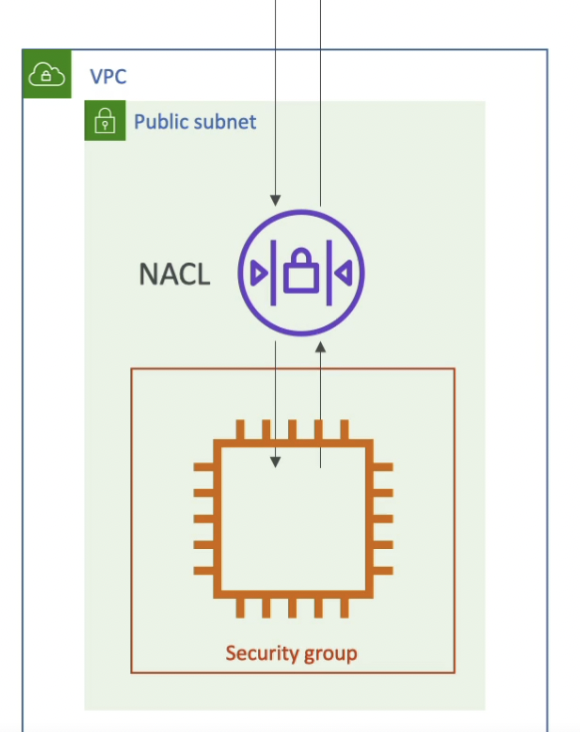

## VPC - Fundamentals (Virtual Private Cloud)
### VPC, Subnets, IGW and NAT
- VPC : private network to deploy your resources(regional resources)
- Subnets: Allow you to partition your network inside your VPC (availability zone resource)
- A public subnet is a subnet that is accessible from internet
- A private subnet is a subnet that is not accessible from internet
- To define access to the internet and between subnets, we use <b>Route Tables</b>.

<b>Internet Gateway</b> : helps our VPC instances connect with the internet.
- Public Subnets have a route to the internet gateway.
- <b>Nat Gateways</b>: (self - managed) allow your instances in your private subnets to access the internet while remaining private.

## Network ACL & Security Groups
- NACL
    - A firewall which control traffic from and to subnet.
    - Can have ALLOW and DENY rules
    - Are attached at Subnet level
    - Rules only include IP address

- Security Groups
    - A firewall that controls traffic to and from an EC2 instance
    - Can have only ALLOW rules
    - Rules include IP addresses and other security groups

- VPC Flow logs
    - Capture info about IP traffic going into your interfaces:
        - VPC Flow logs
        - Subnet Flow logs
        - Elastic Network Interface flow logs
    - Helps to monitor & troubleshoot connectivity issues.
        - Subnets to internet
        - Subnets to Subnets
        - Internet to Subnets

## VPC peering, Endpoints
-  VPC Peering
    - Connect two VPC, privately using AWS network
    - Make them behave as if they're in the same network
    - Must not have overlapping CIDR
    - VPC peering connection is not transitive (must be established for each VPC that need to communicate with one another)

- VPC Endpoint
    - Allows you to connect to AWS Services using a private network instead of public www network
    - Gives enhanced security and lower latency to AWS services